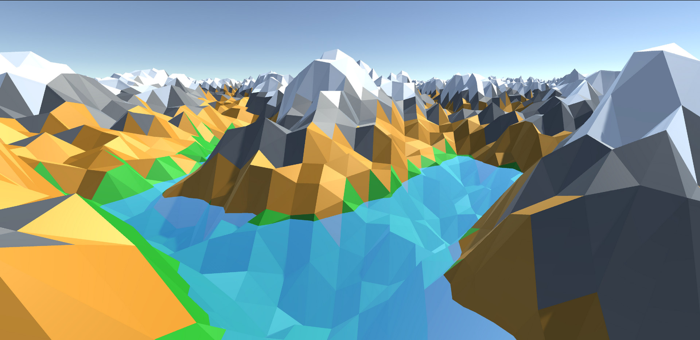
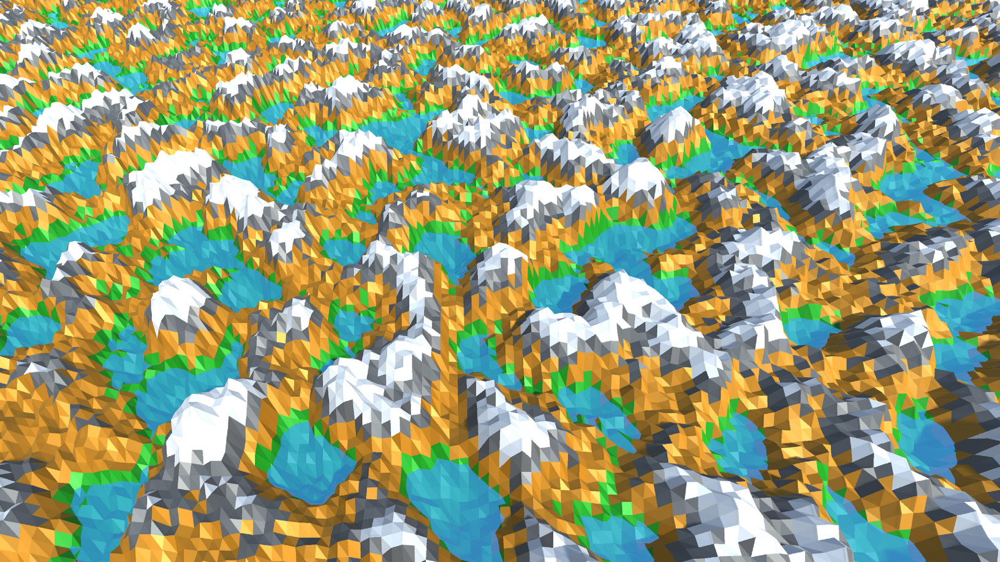

# Low-Poly Landscape

Low-poly procedurally generated terrain in Unity3D (v6).

All meshes are procedurally generated and vertex coloured for stylized low-poly (flat-shaded) look.

Uses Simplex noise for terrain data (improved Perlin noise).

