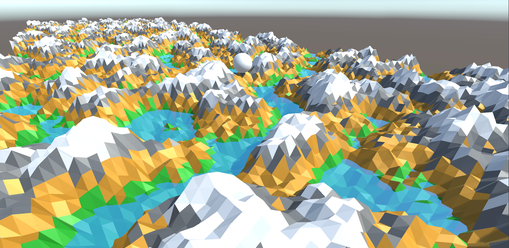

# Low-Poly Landscape
###### Low-poly procedurally generated terrain in Unity3D.

My personal playground. Work in progress.

Uses `Unity 2019.1.8f1`

All meshes are procedurally generated and vertex coloured.
Uses Simplex noise for terrain data (improved Perlin noise).

